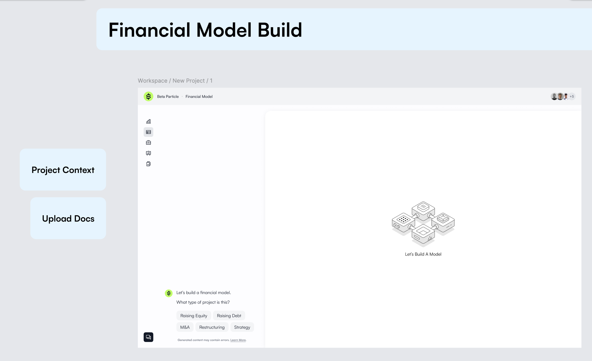
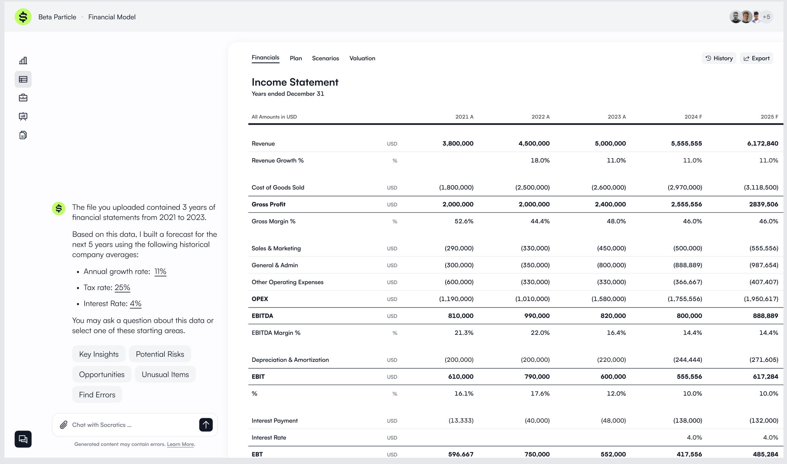
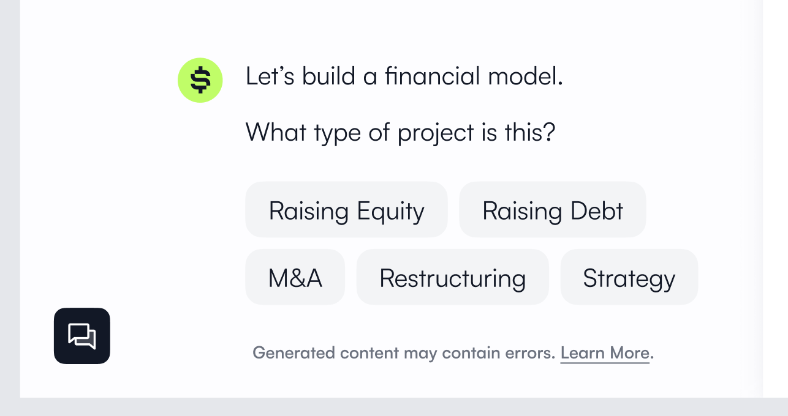
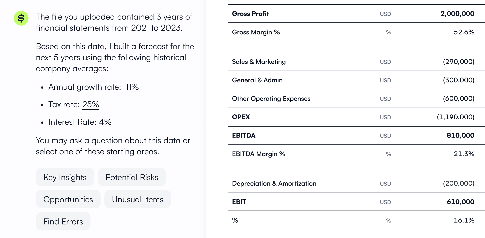
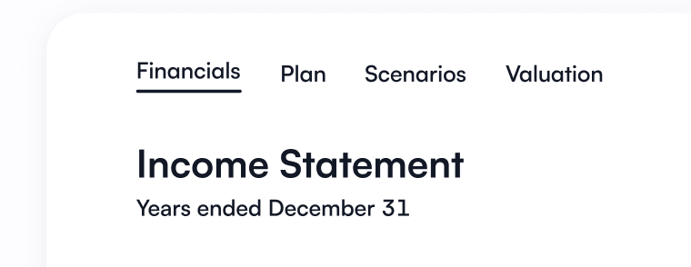
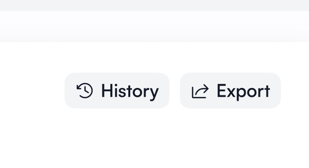
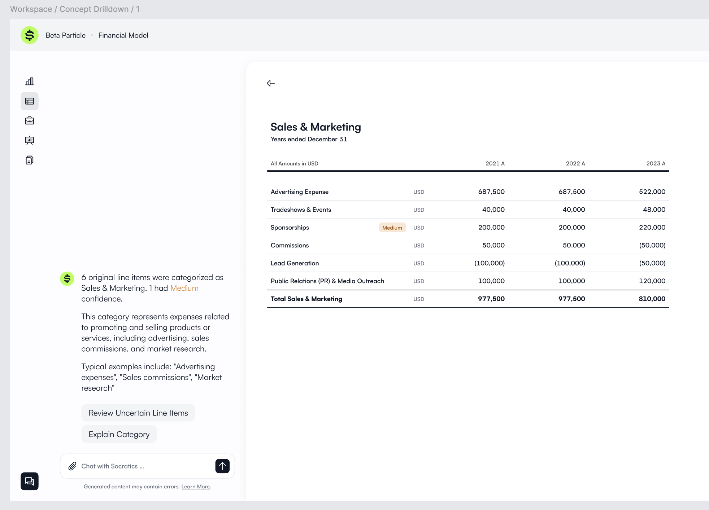

# Routing Architecture

The agora project has a fairly simple routing architecture.

This routing architecture is based on [this Figma design for Socratics Agora](https://www.figma.com/design/H816rUjbZQRu6k3Gk5vGVi/Socratics-Agora?node-id=106-74928&node-type=canvas&t=3X08sR7GaTnoy1Jl-0).

## General overview

- All routes are protected by authentication and authorization rules.
- The routes fall into two categories:
  - Homebase Routes: `/`
  - Financial Model Routes: `/projects/:pid`

## 🏡 Homebase Routes

Homebase routes contains the following:

### The Landing Page
Route: `/`

The landing page of Socratics Agora. Users are redirected to `/projects` if they are authenticated.

### The Projects Page
Route: `/projects`

The projects page lists all of the user's projects.

### The Integrations Page
Route: `/integrations`

The integrations page lists all of the user's enabled integrations.

### The Notifications Page
Route: `/notifications`

The notifications page lists all of the user's notifications.

### The Profile Page
Route: `/profile`

The profile page contains user settings such as basic information, password management, 2FA setup, and account removal.

### The Team Page
Route: `/team`

The team page allows users to manage their teammates, allowing them to edit settings about one user or remove one user from the team.

### The Support Page
Route: `/support`

The support page contains links to Socratics support resources and a mechanism for you to open a ticket with Socratics support.

## 📊 Financial Modeling i.e. "The Workspace" Routes

This is the primary editor workspace for the financial models. From here on out we will use the term "The Workspace" to refer to the financial modeling section of the application.

All pages under financial modeling are protected by authentication and authorization rules.

### The Workspace Landing Page

Route: `/projects/:pid/financial-model`

All financial modeling is within the context of a single project. This means that all routes are mapped to the `/projects/:pid/financial-model` route.

The main landing page for the financial modeling workspace is this route. For a completely new project, this page will render with a blank canvas as shown in the image below. 



This is an example of the workspace with a financial model already built.



### The Workspace Components

1. Sidebar navigation - The sidebar is found on the left, showcasing the various financial models that are available to the user.

2. Canvas - The main canvas where the financial model is built. This is where the spreadsheet is rendered.

3. Toolbar - The toolbar is found at the top, showcasing the name of the project (e.g. Beta Particle) and current context i.e. The Financial Model Workspace, and followed with additional breadcrumbs (e.g. Income Statement, Balance Sheet, or Cash Flow Statement). This toolbar also has a list of users at the upper right, highlighting which users are permitted to access this specific financial modeling workspace.

4. The AI Copilot Chat interface - The AI Copilot Chat interface is found at the left side of the page right beside the sidebar. This interface allows the user to chat with the AI Copilot to help them build their financial model.

### The Workspace AI Copilot

The AI Copilot has a natural language interface that allows the user to chat with the AI Copilot to help them build their financial model.

For example, the user can ask the AI Copilot to fill in a form for them.



As shown in the image above, the AI Copilot is an interface that allows you to chat with your financials data.



All of the above described images are still in the same route: `/projects/:pid/financial-model`.

Now there are still some subpages for the financial modeling workspace, as seen below:



## The Workspace Subpages

### Financials

Route: `/projects/:pid/financial-model`

This is not a subpage perse. The financials tab is accepted as the primary tab for the financial modeling workspace.

This defaults to the latest build of the project.

### Financials of a specific build

Route: `/projects/:pid/financial-model/builds/:build_id`

This is viewing the project data for a specific build.

### Plans

Route: `/projects/:pid/financial-model/plans`

This is a subpage that shows some planning information about the financial model.

### Scenarios

Route: `/projects/:pid/financial-model/scenarios`

This is a subpage that shows the scenarios running on the specified financial model.

### Valuation

Route: `/projects/:pid/financial-model/valuation`

This is a subpage that shows the valuation of a business using the financial model. It has components such as discounted cash flow.

### The Workspace Settings

Route: `/projects/:pid/financial-model/settings`

On the main workspace landing page, on the upper right corner, there are two buttons provided: history and export.

- The history button allows the user to view the history of the financial model. This leads to the History subpage.
- The export button allows the user to export the financial model.



### History

Route: `/projects/:pid/financial-model/history`

The history page shows the history of the financial model. This shows the user the different build versions of the financial model that the user has made.

### Concept Drilldown

Route: `/projects/:pid/financial-model/concepts/:taxonomy-concept-id`

The concept drilldown page shows the user the different concepts that are rolled up to a taxonomy concept ID. This allows the user to understand the different raw line items that compose a taxonomy concept.



**✨ Capabilities ✨**

This page is where users can recategorize a single raw line item into a different taxonomy concept. Please discuss with Derek on how a line item can be recategorized.

# Parameters

Currently, the parameters used in the frontend use UUIDs. For example:

```
https://agora.socratics.ai/projects/2ee88053-b208-4988-afd0-a15f7b603148
```

This isn't pretty. I want this to eventually look like:

```
https://agora.socratics.ai/projects/accel-technologies/financial-model/concepts/net-revenue
```

The above link is what a concept drilldown would look like on the financial model for the `accel-technologies` project.

```
https://agora.socratics.ai/projects/accel-technologies/financial-model/builds/0
```

The above link is for a project given a specific build. In this case, it is build 0.

Later when we permit "sharing" externally, we can have pages linked like this:

```
https://agora.socratics.ai/projects/accel-technologies/financial-model/builds/external-client-name-0
```

Where `external-client-name-0` is a published build, but is technically implemented 
as a `tag` for a specific build. We'll explore this further, but the scope of the
discussion is primarily about page URL routing for the frontend.